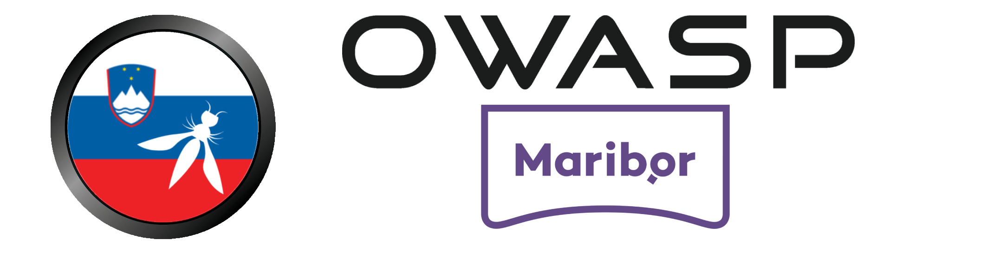

## Welcome/Dobrodošli!

Welcome to OWASP Maribor chapter homepage. We are located in a beautiful town in the south-east of Slovenia.

Our aim is to organize periodic events to share interesting topics regarding cybersecurity, application development, secure software development (SecDevOps), mobile applications, etc.

## Participation

The Open Web Application Security Project (OWASP) is a nonprofit foundation that works to improve the security of software. All of our projects, tools, documents, forums, and chapters are free and open to anyone interested in improving application security.

Chapters are led by local leaders in accordance with the [Chapter Leader Handbook](https://owasp.org/www-policy/operational/chapter-handbook-existing). Financial contributions should only be made online using the authorized online donation button. To be a SPEAKER at ANY OWASP Chapter in the world simply review the [speaker agreement](https://owasp.org/www-policy/legal/speaker-agreement) and then contact the local chapter leader with details of what OWASP Project, independent research, or related software security topic you would like to present.

Everyone is welcome and encouraged to participate in our projects and events. We especially encourage diversity in all our initiatives. OWASP is a fantastic place to learn about application security, to network, and even to build your reputation as an expert. We also encourage you to [become a member](https://owasp.org/membership) or consider a [donation](https://owasp.org/donate) to support our ongoing work.
